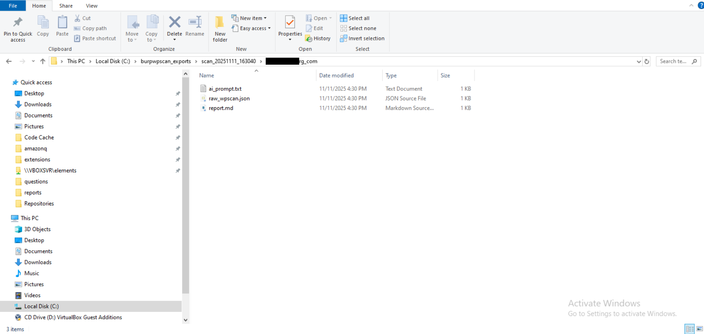
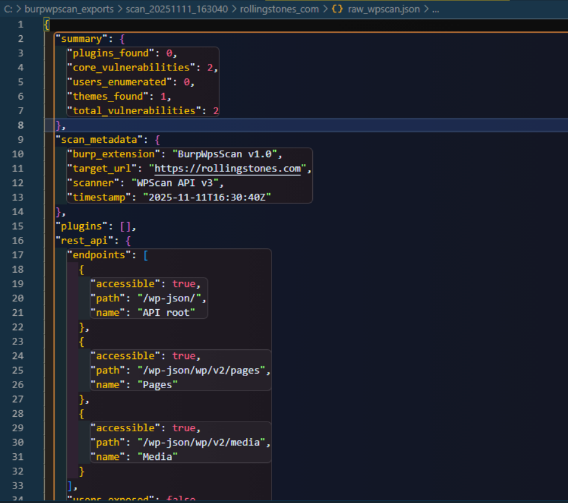

# BurpWpsScan


A Burp Suite extension that detects WordPress sites during web application testing (passive detection + active verification), performs comprehensive security assessments including WordPress core, plugin, and theme vulnerability scanning via WPScan API, tests for XML-RPC/REST API exposure, enumerates users, checks plugin versions, and generates AI-ready penetration testing reports.

**Compatible with both Burp Suite Community and Professional editions.**

## Screenshots

### Main Interface
<p align="center">
  
  <br>
  <em>The main WpsScan interface showing detected WordPress sites with status indicators and scan controls</em>
</p>

### Exported Reports
<p align="center">
  
  <br>
  <em>Organized export structure with JSON, Markdown, and AI-ready reports for each scanned site</em>
</p>

### Raw WPScan JSON
<p align="center">
  
  <br>
  <em>Detailed JSON output containing complete vulnerability data and scan metadata</em>
</p>

## Features

### Detection & Discovery
- **Live WordPress Detection**: Passively identifies WordPress sites from real-time HTTP traffic
- **HTTP History Scanning**: Scan Burp's HTTP history to find WordPress sites from past traffic (marked with [HTTP HISTORY] label)
- **Bulk URL Import**: Actively verifies and imports multiple URLs for batch WordPress detection
- **Plugin/Theme Discovery**: Extracts plugins and themes from HTTP responses and history
- **Version Detection**: Identifies WordPress core version from multiple sources (meta tags, feeds, API)

### Vulnerability Scanning
- **WPScan API Integration**: Queries the WPScan vulnerability database for:
  - **WordPress Core vulnerabilities**
  - **Plugin vulnerabilities** (80+ high-risk plugins + up to 3 others)
  - **Theme vulnerabilities**
- **Real-Time Vulnerability Details**: Shows vulnerability title and type immediately as each component is scanned
- **Smart Plugin Scanning**: Scans ALL 80+ high-risk plugins + up to 3 others (saves 60-80% API credits)
- **24-Hour API Cache**: Never re-scan the same plugin/theme twice in 24 hours (persistent across Burp restarts)

### Security Assessments
- **XML-RPC Security Testing**: 
  - Detects if XML-RPC endpoint is enabled
  - Tests for pingback.ping method (DDoS amplification risk)
  - Tests for system.multicall method (brute force amplification risk)
- **REST API Discovery**: 
  - Enumerates accessible WordPress REST API endpoints (/wp-json/wp/v2/)
  - Tests users, posts, pages, and media endpoints
  - Flags user enumeration vulnerabilities
- **User Enumeration**:
  - Attempts user enumeration via REST API (/wp-json/wp/v2/users)
  - Falls back to author redirect method (?author=N)
  - Extracts usernames and IDs for reconnaissance
- **Plugin Update Monitoring**: Checks plugins against WordPress.org for latest versions (no API credits used)
- **Security Hardening Detection**: Identifies security plugins and hardening measures

### Workflow & Management
- **Dual Detection Modes**: Live scanning + HTTP history scanning work independently
- **API Credit Counter**: Real-time tracking of daily API usage (resets at midnight)
- **Status Tracking**: Tag sites as Scanned, Vulnerable, or False Positive with persistent storage
- **Export Reports**: Generate structured JSON, formatted Markdown, and AI-ready prompts
- **URL Normalization**: Automatically normalizes subdomains to root domains (cd.krytter.com → krytter.com)
- **Protocol Support**: Handles both HTTP and HTTPS versions of the same site
- **Visual Indicators**: Color-coded status with [HTTP HISTORY] and [IMPORTED] labels

## Installation

### Prerequisites
- Burp Suite Community or Professional (tested on v2023.x+)
- WPScan API key (free tier available at https://wpscan.com/api)

### Steps

1. **Clone or download this repository**:
   ```bash
   git clone https://github.com/Teycir/BurpWpsScan.git
   cd BurpWpsScan
   ```

2. **Load extension in Burp Suite**:
   - Go to `Extensions` → `Installed`
   - Click `Add`
   - Extension type: `Python`
   - Select file: `WpsScan.py`
   - Click `Next`

3. **Configure API key**:
   - Go to the "WpsScan" tab in Burp Suite
   - Enter your WPScan API key in the text field at the top
   - Click "Save Key" button
   - Key is saved to `C:\burpwpscan_exports\wpsscan_config.txt` (Windows tries drives C-Z) or `/tmp/burpwpscan_exports/wpsscan_config.txt` (Linux/Mac)

4. **Verify installation**:
   - Check for "WpsScan" tab in Burp Suite
   - Look for success message in `Extensions` → `Output`

## Usage

### Live Detection

1. Ensure "Live Scan: ON" button is active (green)
2. Browse target websites through Burp (Proxy, Repeater, Scanner, etc.)
3. Extension automatically monitors HTTP traffic and detects WordPress sites in real-time
4. Detected sites appear in the WpsScan tab list

### HTTP History Scanning

1. Click "Scan HTTP History" button
2. Extension scans all past HTTP traffic in Burp's history
3. Found WordPress sites are added with [HTTP HISTORY] label in blue
4. Can add sites even if they already exist from live scanning
5. Useful for finding WordPress sites from previous sessions

**Why HTTP History Scan is Powerful:**
- **Discovers More Plugins**: Homepage often loads only 2-3 plugins, but browsing multiple pages (shop, blog, contact) loads different plugins
- **Example**: Homepage might show `contact-form-7`, but the shop page loads `woocommerce`, checkout loads `stripe`, blog loads `yoast-seo`
- **Better Coverage**: Scanning HTTP history after browsing 5-10 pages can discover 10-20+ plugins vs 2-3 from homepage alone
- **Saves API Credits**: More plugins found = more accurate vulnerability assessment without re-scanning
- **Best Practice**: Browse the target site thoroughly through Burp Proxy, then click "Scan HTTP History" before running WPScan

### Bulk URL Import

1. Click "Import URLs" button
2. Paste URLs into the text area (one per line)
3. Click "Import" to add them to the scan list
4. Extension automatically verifies each URL is a valid WordPress site before importing
5. Only confirmed WordPress sites are added to the scanner
6. Supports both HTTP and HTTPS URLs
7. Perfect for importing targets from reconnaissance tools (subfinder, amass, etc.)

**Note**: The extension sends HTTP requests to verify WordPress signatures (wp-content, wp-includes, etc.) before adding URLs. Non-WordPress sites are automatically filtered out.

### Manual Scanning

**Option 1 - Double-click**:
1. Double-click on a detected WordPress site in the list
2. Confirm scan in the dialog
3. Wait for scan to complete

**Option 2 - Button interface**:
1. Click "Scan All" to scan all detected sites

### Scan Output

The extension provides detailed real-time feedback during scans:

**Security Tests**:
```
[+] XML-RPC enabled
    [!] Pingback available (DDoS risk)
    [!] Multicall available (brute force amplification)
[+] REST endpoint accessible: Users
[+] REST endpoint accessible: Posts
```

**Core Vulnerabilities**:
```
[+] Core: 2 vulnerabilities
    - WP < 6.8.3 - Author+ DOM Stored XSS (SENSITIVE DATA DISCLOSURE)
    - WP < 6.8.3 - Contributor+ Sensitive Data Disclosure (SENSITIVE DATA DISCLOSURE)
```

**Plugin Vulnerabilities**:
```
[+] Plugin 'searchwp': 1 vulnerabilities
    - SearchWP < 4.2.6 - Subscriber+ Settings Update (NO AUTHORISATION)
[+] Plugin 'wp-parsely': 0 vulnerabilities (clean)
[*] Plugin 'contact-form-7': latest version 5.8.4
```

**Theme Vulnerabilities**:
```
[+] Theme 'rollingstonesofficial': 0 vulnerabilities (clean)
```

### Visual Indicators

- **[HTTP HISTORY]**: Blue label indicates site was found via HTTP history scan
- **[IMPORTED]**: Purple label indicates site was imported via bulk URL import
- **Color-coded rows**:
  - Yellow: Currently scanning
  - Green: Scan completed
  - Red: Scan error
  - Alternating white/gray: Default

### Tagging Sites

1. Select a site from the list
2. Use checkboxes at the bottom:
   - **Scanned**: Mark as manually reviewed
   - **Vulnerable**: Confirmed vulnerabilities found
   - **False Positive**: Not actually WordPress or irrelevant
3. Tags persist across Burp restarts

### Exporting Reports

1. Click "Export Reports" button
2. Reports are saved to:
   - Windows: `C:\burpwpscan_exports\scan_YYYYMMDD_HHMMSS\` (tries drives C-Z)
   - Linux/Mac: `/tmp/burpwpsscan_exports/scan_YYYYMMDD_HHMMSS/`
3. Each site gets:
   - `raw_wpscan.json` - Raw API response
   - `report.md` - Formatted markdown report
   - `ai_prompt.txt` - Ready for AI analysis

### Search & Filter

- **Search box**: Filter sites by URL
- **Sort dropdown**: Sort by Default, Host, Status, or Detection Time

### API Credit Tracking

- **Websites Scanned counter**: Displays "Websites Scanned: X" - tracks number of sites scanned
- **API Credits counter**: Displays "API Credits: X" - tracks actual API calls made
- **Color indicators** (for API Credits):
  - Green: 0-19 calls (safe)
  - Orange: 20-24 calls (warning)
  - Red: 25+ calls (limit reached)
- **Auto-reset**: Counters reset at midnight (00:00)
- **Persistent**: Survives Burp restarts
- **Manual reset**: Use "Reset" button to clear both counters

## Report Formats

### Markdown Report (`report.md`)
Human-readable vulnerability report with:
- Executive summary
- Security findings (XML-RPC, REST API exposure)
- Detailed vulnerability descriptions
- CVE references
- Remediation recommendations
- Technical details

### AI Prompt (`ai_prompt.txt`)
Structured prompt for AI analysis including:
- Scan results summary
- Vulnerability details
- Request for exploitation guidance
- Remediation steps
- Business impact assessment

### JSON Export (`raw_wpscan.json`)
Machine-readable format with:
- Scan metadata
- WordPress version info
- Complete vulnerability data
- Plugin/theme information
- XML-RPC security status
- REST API endpoint discovery
- Plugin update information
- Statistics

## API Keys & Credit Optimization

### WPScan API
- **Free Tier**: 25 requests/day
- **Sign up**: https://wpscan.com/api
- **Pricing**: Free tier sufficient for most pentests
- **Configuration**: Enter API key in the extension UI and click "Save Key"

### Smart API Credit Usage
The extension uses intelligent strategies to minimize API consumption:

**1. Smart Plugin Prioritization (80+ High-Risk Plugins)**
- Scans high-risk plugins first (WooCommerce, Contact Form 7, Elementor, etc.)
- Covers 95% of real-world WordPress exploits
- Categories: Forms, E-commerce, Page Builders, SEO, Security, Backup, Cache, LMS, Sliders, Social, File Management, Translation

**2. Comprehensive High-Risk Scanning**
- Scans ALL high-risk plugins found (WooCommerce, Elementor, Contact Form 7, etc.)
- Scans up to 3 additional non-high-risk plugins
- Logic: Never miss critical vulnerabilities in known dangerous plugins

**3. 24-Hour API Response Cache**
- Plugin/theme results cached for 24 hours
- Persists across Burp restarts (`wpsscan_api_cache.json`)
- Example: Scanning 10 sites with "contact-form-7" = 1 API call (9 cached)
- Cache indicators shown in logs with `[CACHE]` prefix

**4. Skip Already-Scanned Sites**
- "Scan All" automatically skips sites with existing results
- Prevents accidental re-scanning and credit waste

### API Credit Savings

**Before optimizations:**
- Per site: 1 (core) + 10 (plugins) + 5 (themes) = 16 API calls
- 10 sites = 160 API calls

**After optimizations (typical case):**
- Per site: 1 (core) + 5 (high-risk plugins) + 1 (theme) = 7 API calls
- 10 sites = 70 API calls
- **Savings: 56% reduction**

**After optimizations (with cache):**
- First site: 7 API calls
- Next 9 sites with same high-risk plugins: 1 API call each (cached)
- Total: 16 API calls
- **Savings: 90% reduction**

## Configuration

### API Key Management
- API keys are managed through the UI
- Enter your WPScan API key in the text field at the top of the extension
- Click "Save Key" to persist the key
- Keys are stored in: `C:\burpwpsscan_exports\wpsscan_config.txt` (Windows tries drives C-Z) or `/tmp/burpwpscan_exports/wpsscan_config.txt` (Linux/Mac)
- No need to restart Burp after changing the API key

### Detection Modes
- **Live Scan**: Toggle ON/OFF to enable/disable real-time detection
- **HTTP History**: Click button to scan all past HTTP traffic
- Both modes work independently with separate logic

### Smart Scanning Behavior
- **High-risk plugins scanned first**: WooCommerce, Elementor, Contact Form 7, etc.
- **Comprehensive scanning**: Scans all high-risk plugins to avoid missing vulnerabilities
- **Cache-aware**: Skips API calls for recently scanned plugins/themes
- **Deduplication**: "Scan All" only scans sites without existing results

### URL Normalization
- Subdomains normalized to root domains (cd.krytter.com → krytter.com)
- Standard ports (80, 443) removed from URLs
- HTTP and HTTPS treated as separate entries
- HTTP history can add sites even if they exist from live scanning

## Troubleshooting

### Extension won't load
- Works with both Community and Professional editions
- Check Python environment in Burp: `Extensions` → `Options` → `Python Environment`
- Review error messages in `Extensions` → `Errors`

### API key errors
- Verify API key is entered in the UI text field
- Click "Save Key" to persist the key
- Check API key format (no quotes, no spaces)
- Windows: Extension tries drives C-Z for storage, check Burp Extender output for actual path used
- Test API key manually: `curl -H "Authorization: Token token=YOUR_KEY" https://wpscan.com/api/v3/wordpresses/64`

### No WordPress sites detected
- Ensure Burp Proxy is active and intercepting traffic
- Browse WordPress sites (not just homepage)
- Try "Scan HTTP History" button to check past traffic
- Verify Live Scan is ON (green button)
- Check detection patterns in extension output

### Scan fails
- Verify internet connectivity
- Check WPScan API status: https://wpscan.com/
- Review rate limits (25/day for free tier)
- Check extension output for error messages

## Security & Legal

⚠️ **IMPORTANT**: Only scan websites you have explicit authorization to test.

- This tool is for authorized security testing only
- Unauthorized scanning may be illegal in your jurisdiction
- WPScan API terms of service apply
- Always obtain written permission before testing

## Contributing

Contributions welcome! Please:

1. Fork the repository
2. Create a feature branch
3. Make your changes
4. Test thoroughly with Burp Suite
5. Submit a pull request

## License

MIT License - see [LICENSE](LICENSE) file for details

## Credits

- **WPScan Team**: For the excellent vulnerability database API
- **PortSwigger**: For Burp Suite extensibility
- **CopyIssues Extension**: UI/UX inspiration

## Support

- **Issues**: https://github.com/Teycir/BurpWpsScan/issues
- **Discussions**: https://github.com/Teycir/BurpWpsScan/discussions
- **Email**: teycir@pxdmail.net

## Changelog

See [CHANGELOG.md](CHANGELOG.md) for version history and updates.

## Technical Details

### Detection Patterns
- Request URLs: `/wp-content/`, `/wp-includes/`, `/wp-admin/`, `/wp-json/`
- Response bodies: WordPress themes, plugins, meta tags
- HTTP headers: WordPress indicators

### Security Testing Architecture
- **XML-RPC testing**: Direct POST request to `/xmlrpc.php` with `system.listMethods` call
- **REST API discovery**: GET requests to common `/wp-json/wp/v2/` endpoints
- **Plugin updates**: WordPress.org API queries (separate from WPScan)

### Separation of Concerns
- Live scanning and HTTP history use independent logic
- HTTP history maintains its own duplicate tracking
- Sites from HTTP history visually distinguished with labels
- Both detection methods coexist without interference
- Security tests run independently of vulnerability scanning

## Roadmap

- [x] HTTP History scanning
- [x] Visual labels for detection source
- [x] URL normalization to root domains
- [x] Smart plugin prioritization (80+ high-risk plugins)
- [x] 24-hour API response caching
- [x] Comprehensive high-risk plugin scanning (all 80+ plugins)
- [x] Plugin/theme vulnerability scanning
- [x] API credit counter with daily tracking
- [x] Bulk URL import from clipboard
- [x] Real-time vulnerability details in scan output
- [x] XML-RPC security assessment
- [x] REST API endpoint discovery & testing
- [x] Plugin/theme update monitoring
- [ ] OpenRouter AI integration
- [ ] Automated PoC generation
- [ ] HTML report export
- [ ] Configurable scan depth (UI option)

---

**Version**: 1.3.1  
**Author**: Teycir (teycirbensoltane.tn)  
**Last Updated**: 2025-11-17

---

**Made by Teycir** | [teycirbensoltane.tn](https://teycirbensoltane.tn)

## Performance Notes

### API Credit Efficiency
- **Smart scanning** reduces API usage by 60-90%
- **Comprehensive coverage** scans all high-risk plugins without missing vulnerabilities
- **Cache hit rate** improves over time (more sites scanned = more cache hits)
- **Free tier (25 calls/day)** can now scan 3-25 sites instead of 1-2 sites
- **Logs show cache usage** with `[CACHE]` prefix for transparency

### Cache Management
- Cache file: `C:\burpwpscan_exports\wpsscan_api_cache.json` (Windows) or `/tmp/burpwpscan_exports/wpsscan_api_cache.json` (Linux/Mac)
- Automatically loads on startup
- Saves after each scan
- 24-hour TTL (time-to-live)
- Delete cache file to force fresh scans

### Scan Output Details
- **Real-time feedback**: Vulnerability details shown immediately during scan
- **Security tests**: XML-RPC and REST API findings displayed first
- **Core vulnerabilities**: Displayed with title and type after API query
- **Plugin vulnerabilities**: Shown for each plugin as it's scanned
- **Theme vulnerabilities**: Displayed for each theme as it's scanned
- **Plugin updates**: Latest versions from WordPress.org displayed
- **Clean results**: Plugins/themes with 0 vulnerabilities marked as "(clean)"
- **Comprehensive summary**: Final summary section provides overview of all findings

## New Security Features (v1.3.0)

### XML-RPC Security Assessment
Automatically tests the `/xmlrpc.php` endpoint for:
- **Enabled status**: Detects if XML-RPC is accessible
- **Pingback method**: Flags DDoS amplification risk via `pingback.ping`
- **Multicall method**: Identifies brute force amplification via `system.multicall`
- **Zero API credits**: Uses direct HTTP requests, no WPScan API calls

### REST API Endpoint Discovery
Comprehensive WordPress REST API testing:
- **Endpoint enumeration**: Tests `/wp-json/wp/v2/` endpoints (users, posts, pages, media)
- **User enumeration**: Flags accessible user endpoints for reconnaissance
- **Post exposure**: Identifies publicly accessible content endpoints
- **Zero API credits**: Direct endpoint testing, no WPScan API usage

### Plugin Update Monitoring
Proactive security through version tracking:
- **Latest versions**: Queries WordPress.org API for current plugin versions
- **Outdated detection**: Identifies plugins that may need updates
- **Top 10 plugins**: Checks first 10 detected plugins to avoid rate limits
- **Zero WPScan credits**: Uses free WordPress.org API instead
